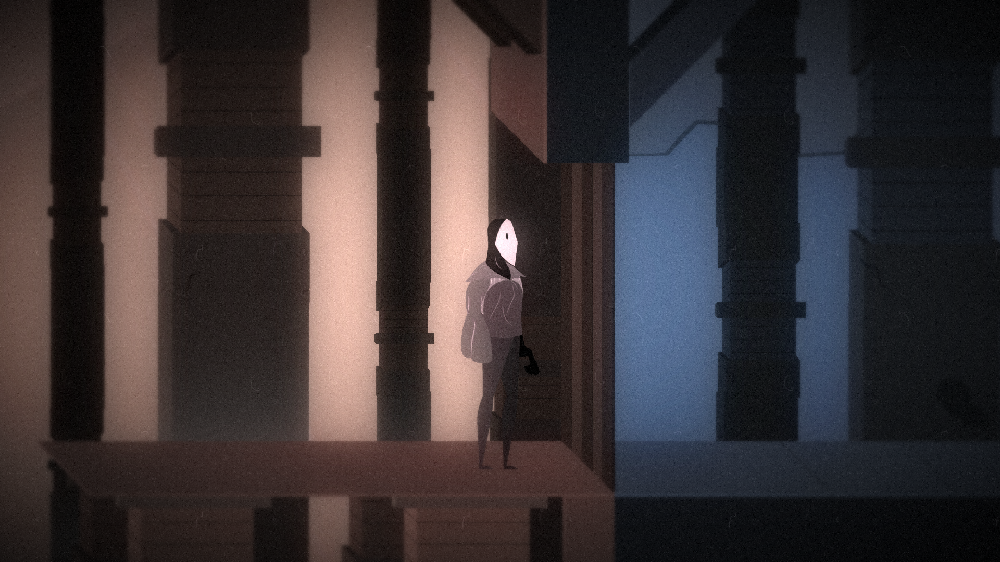

# Limina Prototype Project

  

This is my second prototype game made using Unity and C#, which I created as a study project while I was learning game development. This time I was learning about using some APIs like "DragonsBonesAPI", basic 2D physics and sounds managment.

<b>NOTE: Only available has a portfolio game and isn't recommended to be played has a complete game.</b>

Developed: 2017.

The game had a big influence on the retro game "Another world" from 1993 and "Silent Hill". There was another version with three different difficulties and level changes based on that, but for the long time sadly that source code is missed, so this is a previous version with an unique difficulty.

<b>[Itch.io build link](https://deadlysmile.itch.io/limina)</b>

---

### Features:
- <b>Hardcore side-scroll survival horror.</b>
- <b>Beautiful 2D graphics.</b>
- <b>3 complete levels unlockable with code, like old arcade games.</b>
- <b>Immersive gameplay, pay attention to the sounds.</b>

---

### Changelog

- #### v0.2:
  - Updated Unity engine from 5.4 to 2021.3.
  - Little UI optimization.
  - Translated to english (originally was full spanish).
  - Balancing changes for a more friendly gameplay.
- #### v0.1:
  - Initial version made on 2017 (first build).
